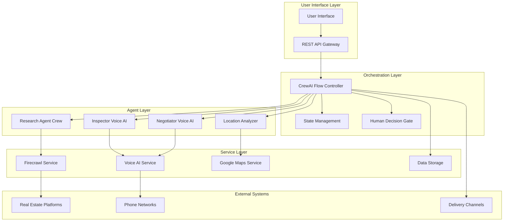
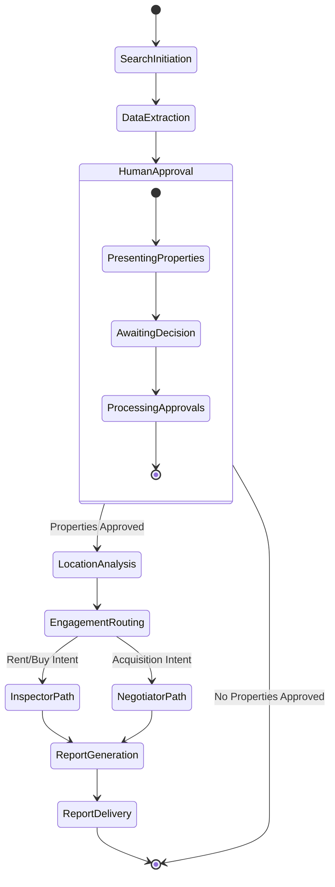

# Design Document

## Overview

The AI Real Estate Agent is a sophisticated, event-driven system that automates the complete real estate discovery and engagement process. The system orchestrates multiple AI agents through a five-phase workflow: Deep Discovery (data extraction), Human Decision Gate (approval process), Intelligence Phase (location analysis), Engagement Phase (voice interactions), and Delivery Phase (comprehensive reporting).

The architecture leverages CrewAI Flows for workflow orchestration, Firecrawl for dynamic web scraping, voice AI platforms for phone interactions, Google Maps APIs for geospatial analysis, and Pydantic models for structured data validation. The system implements human-in-the-loop controls to ensure cost-effective operations and user oversight.

## Architecture

### System Architecture Overview



### Workflow State Machine



## Components and Interfaces

### Core Components

#### 1. Flow Controller
**Responsibility:** Orchestrates the entire workflow using CrewAI Flows
**Key Methods:**
- `initiate_search(criteria: SearchCriteria) -> FlowExecution`
- `process_human_decisions(approvals: List[PropertyApproval]) -> None`
- `route_engagement(intent: EngagementIntent) -> EngagementPath`

#### 2. Research Agent Crew
**Responsibility:** Extracts comprehensive property data from real estate platforms
**Key Methods:**
- `scrape_properties(criteria: SearchCriteria) -> List[PropertyRecord]`
- `extract_contact_info(listing_url: str) -> ContactInfo`
- `capture_image_urls(listing_url: str) -> List[str]`

#### 3. Location Analyzer
**Responsibility:** Performs geospatial analysis and location intelligence
**Key Methods:**
- `analyze_location(address: Address) -> LocationIntelligence`
- `assess_traffic_patterns(coordinates: Coordinates) -> TrafficAnalysis`
- `evaluate_amenities(coordinates: Coordinates, radius: int) -> AmenityAnalysis`

#### 4. Voice AI Agents
**Responsibility:** Conducts phone calls with agents and property owners
**Key Methods:**
- `make_call(phone_number: str, script: CallScript) -> CallResult`
- `navigate_phone_menu(menu_options: List[str]) -> bool`
- `conduct_conversation(conversation_flow: ConversationFlow) -> Transcript`

#### 5. Human Decision Gate
**Responsibility:** Manages approval workflow and user interactions
**Key Methods:**
- `present_properties(properties: List[PropertyRecord]) -> None`
- `collect_approvals() -> List[PropertyApproval]`
- `validate_decisions(approvals: List[PropertyApproval]) -> bool`

### Interface Definitions

```python
# Core Data Models
class SearchCriteria(BaseModel):
    location: str
    property_type: PropertyType
    bedrooms: Optional[int]
    bathrooms: Optional[int]
    price_range: Optional[PriceRange]
    additional_filters: Dict[str, Any]

class PropertyRecord(BaseModel):
    id: str
    address: Address
    specifications: PropertySpecs
    image_urls: List[str]
    contact_info: ContactInfo
    listing_url: str
    extracted_at: datetime

class LocationIntelligence(BaseModel):
    traffic_analysis: TrafficAnalysis
    noise_assessment: NoiseAssessment
    amenity_scores: AmenityScores
    environmental_factors: EnvironmentalFactors

class CallResult(BaseModel):
    success: bool
    transcript: str
    recording_url: Optional[str]
    booking_confirmation: Optional[BookingDetails]
    negotiation_outcome: Optional[NegotiationResult]
```

## Data Models

### Property Data Structure

```python
class PropertySpecs(BaseModel):
    bedrooms: int
    bathrooms: float
    square_footage: Optional[int]
    lot_size: Optional[float]
    year_built: Optional[int]
    property_type: PropertyType
    listing_price: Decimal
    price_per_sqft: Optional[Decimal]

class ContactInfo(BaseModel):
    agent_name: str
    agent_phone: str
    agent_email: Optional[str]
    brokerage: Optional[str]
    owner_contact: Optional[OwnerContact]

class ImageData(BaseModel):
    url: str
    caption: Optional[str]
    image_type: ImageType  # exterior, interior, floorplan, etc.
```

### Location Analysis Models

```python
class TrafficAnalysis(BaseModel):
    peak_hour_congestion: CongestionLevel
    average_commute_times: Dict[str, int]  # destination -> minutes
    public_transit_access: TransitAccess
    parking_availability: ParkingAssessment

class AmenityScores(BaseModel):
    schools: SchoolRatings
    shopping: ShoppingAccess
    healthcare: HealthcareAccess
    recreation: RecreationFacilities
    restaurants: DiningOptions
```

### Workflow State Models

```python
class FlowState(BaseModel):
    execution_id: str
    current_phase: WorkflowPhase
    search_criteria: SearchCriteria
    extracted_properties: List[PropertyRecord]
    approved_properties: List[str]  # property IDs
    location_analyses: Dict[str, LocationIntelligence]
    call_results: List[CallResult]
    final_report: Optional[UnifiedReport]

class PropertyApproval(BaseModel):
    property_id: str
    approved: bool
    engagement_intent: EngagementIntent
    user_questions: List[str]
    priority_level: PriorityLevel
```

## Correctness Properties

*A property is a characteristic or behavior that should hold true across all valid executions of a system-essentially, a formal statement about what the system should do. Properties serve as the bridge between human-readable specifications and machine-verifiable correctness guarantees.*

### Property Reflection

After analyzing all acceptance criteria, several properties can be consolidated to eliminate redundancy:

- Properties 2.1-2.3 (data extraction completeness) can be combined into a comprehensive extraction property
- Properties 3.1-3.4 (approval workflow) can be consolidated into approval process integrity
- Properties 4.1-4.4 (location analysis) can be unified into location analysis completeness
- Properties 5.1-5.5 and 6.1-6.5 (voice AI operations) can be grouped by engagement type
- Properties 7.1-7.2 (report generation) can be combined into report completeness
- Properties 8.1-8.5 (error handling) can be unified into system resilience

### Core Properties

**Property 1: Search Criteria Processing**
*For any* valid search criteria input, the system should initiate Research_Agent deployment with parameters that match the specified criteria, and all returned properties should satisfy the geographic and specification constraints
**Validates: Requirements 1.1, 1.2, 1.3**

**Property 2: Input Validation and Format Support**
*For any* ambiguous, incomplete, or alternative format search criteria, the system should either request clarification for invalid inputs or successfully process valid alternative formats
**Validates: Requirements 1.4, 1.5**

**Property 3: Comprehensive Data Extraction**
*For any* property listing processed by Research_Agent, the extracted PropertyRecord should contain all available structured specifications, image URLs for frontend display, and contact information, with graceful handling of missing data
**Validates: Requirements 2.1, 2.2, 2.3, 2.4, 2.5**

**Property 4: Frontend Approval Workflow**
*For any* set of extracted properties, the frontend interface should display all properties with complete data including image URLs, accept individual approval decisions, and ensure only approved properties proceed to subsequent phases
**Validates: Requirements 3.1, 3.2, 3.3, 3.4**

**Property 5: Location Analysis Completeness**
*For any* approved property, the Location_Analyzer should perform comprehensive geospatial analysis covering traffic patterns, environmental factors, and amenity distances, with structured output and graceful handling of data limitations
**Validates: Requirements 4.1, 4.2, 4.3, 4.4, 4.5**

**Property 6: Inspector AI Engagement**
*For any* property with rental/purchase intent, the Inspector_AI should successfully navigate phone systems, conduct natural conversations for booking inspections, ask all user-defined questions, and record complete call results
**Validates: Requirements 5.1, 5.2, 5.3, 5.4, 5.5**

**Property 7: Negotiator AI Engagement**
*For any* property with acquisition intent, the Negotiator_AI should engage owners with appropriate conversation strategies, handle various response scenarios gracefully, and document all negotiation outcomes
**Validates: Requirements 6.1, 6.2, 6.3, 6.4, 6.5**

**Property 8: Background Operations and Notifications**
*For any* workflow execution, the system should operate autonomously in the background when calls fail, retry calls after several hours, compile reports in user accounts when complete, and send notifications via email or WhatsApp
**Validates: Requirements 7.1, 7.2, 7.3, 7.4, 7.5**

**Property 9: Privacy and Security Compliance**
*For any* data processing operation, the system should maintain proper consent mechanisms, implement encryption, comply with privacy regulations, support data deletion, and execute incident response procedures
**Validates: Requirements 8.1, 8.2, 8.3, 8.4, 8.5**

<function_calls>
<invoke name="prework">
<parameter name="featureName">ai-real-estate-agent

## Background Operations

### Autonomous Workflow Management

The system is designed to operate autonomously in the background, allowing users to close their computers while the AI continues working:

#### 1. Background Call Management
- **Call Retry Logic:** When Voice_AI calls fail to connect, the system schedules retry attempts after several hours
- **Persistent State:** Workflow state is maintained across system restarts and user sessions
- **Queue Management:** Failed calls are queued for background processing with intelligent scheduling

#### 2. User Account Integration
- **Report Storage:** Completed reports are stored in user accounts for later access
- **Notification System:** Email and WhatsApp notifications alert users when reports are ready
- **Frontend Integration:** User interface displays property search results and approval options

#### 3. Autonomous Operation
- **Independent Processing:** System continues operations even when user interface is closed
- **Progress Tracking:** Real-time status updates available when users return to the system
- **Completion Handling:** Automatic report generation and notification upon workflow completion

## Testing Strategy

### Dual Testing Approach

The system requires both unit testing and property-based testing to ensure comprehensive coverage:

- **Unit tests** verify specific examples, edge cases, and integration points
- **Property tests** verify universal properties across all inputs using generated test data
- Together they provide complete coverage: unit tests catch concrete bugs, property tests verify general correctness

### Unit Testing Strategy

Unit tests will focus on:
- **Component Integration:** Testing interactions between Flow Controller and agents
- **API Integration:** Verifying external service integrations (Firecrawl, Voice AI, Google Maps)
- **Error Scenarios:** Testing specific error conditions and recovery procedures
- **Data Validation:** Verifying Pydantic model validation and serialization
- **State Management:** Testing workflow state transitions and persistence

### Property-Based Testing Strategy

**Testing Framework:** We will use Hypothesis for Python property-based testing, configured to run a minimum of 100 iterations per property test.

Each property-based test will:
- Generate random but valid test data using smart generators
- Test universal properties that should hold across all inputs
- Be tagged with comments referencing the design document property
- Use the format: `**Feature: ai-real-estate-agent, Property {number}: {property_text}**`

**Test Data Generators:**
- **SearchCriteria Generator:** Creates valid search parameters with various combinations
- **PropertyRecord Generator:** Generates realistic property data with edge cases
- **LocationData Generator:** Creates geographic coordinates and address data
- **CallScript Generator:** Generates conversation flows and phone interaction scenarios

**Property Test Examples:**
```python
@given(search_criteria=search_criteria_generator())
def test_search_criteria_processing_property(search_criteria):
    """**Feature: ai-real-estate-agent, Property 1: Search Criteria Processing**"""
    # Test that search criteria always result in appropriate agent deployment
    
@given(property_records=property_record_list_generator())
def test_approval_workflow_integrity_property(property_records):
    """**Feature: ai-real-estate-agent, Property 4: Approval Workflow Integrity**"""
    # Test that approval workflow maintains integrity across all property sets
```

### Integration Testing

- **End-to-End Workflow Testing:** Complete workflow execution with mock external services
- **External Service Integration:** Testing with actual APIs in controlled environments
- **Performance Testing:** Load testing for concurrent workflow executions
- **Security Testing:** Validation of encryption, authentication, and data protection

### Testing Infrastructure

- **Mock Services:** Comprehensive mocks for Firecrawl, Voice AI, and Google Maps APIs
- **Test Data Management:** Realistic test datasets for property listings and location data
- **Continuous Integration:** Automated test execution on code changes
- **Test Reporting:** Detailed coverage reports and property test failure analysis