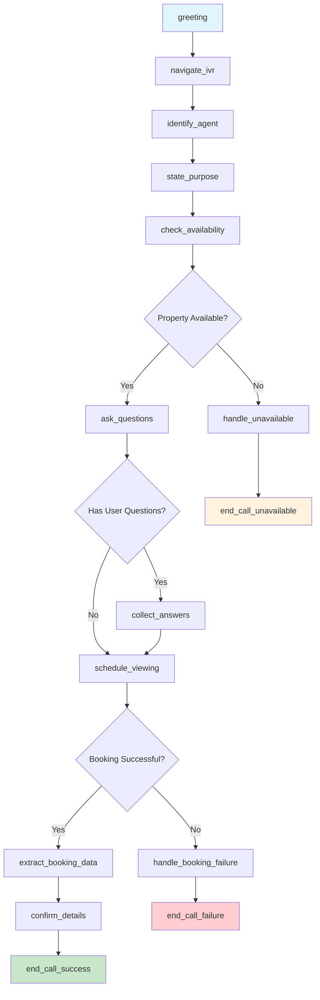

# Retell AI Inspector Agent - Multi-Prompt Flow Design

## State Flow Diagram

## State Definitions

### 1. **greeting**
- **Purpose**: Initial contact and identification
- **Prompt**: "Hi, this is Steve calling about the property at {{property_address}}. Am I speaking with {{contact_name}}?"
- **Functions**: None
- **Transitions**: 
  - If correct person → `navigate_ivr`
  - If wrong person → ask for transfer → `navigate_ivr`

### 2. **navigate_ivr**
- **Purpose**: Handle phone menu systems
- **Prompt**: Navigate IVR menus to reach the right department
- **Functions**: `Press Digit (IVR Navigation)` (if needed)
- **Transitions**: Always → `identify_agent`

### 3. **identify_agent**
- **Purpose**: Confirm speaking with listing agent
- **Prompt**: "Great! I'm calling about your listing at {{property_address}}. Are you the listing agent for this property?"
- **Functions**: None
- **Transitions**: 
  - If yes → `state_purpose`
  - If no → ask for transfer → `state_purpose`

### 4. **state_purpose**
- **Purpose**: Explain reason for call
- **Prompt**: "My client is very interested in this property and would like to schedule a viewing. Is the property still available?"
- **Functions**: None
- **Transitions**: Always → `check_availability`

### 5. **check_availability**
- **Purpose**: Confirm property status
- **Prompt**: Listen for availability confirmation and respond appropriately
- **Functions**: None
- **Transitions**: 
  - If available → `ask_questions`
  - If not available → `handle_unavailable`

### 6. **ask_questions**
- **Purpose**: Ask user-defined questions
- **Prompt**: "Before we schedule, my client has a few questions: {{user_questions}}. If no questions, proceed to scheduling."
- **Functions**: None
- **Transitions**: 
  - If has questions → `collect_answers`
  - If no questions → `schedule_viewing`

### 7. **collect_answers**
- **Purpose**: Gather answers to client questions
- **Prompt**: Ask each question from {{user_questions}} and collect responses
- **Functions**: None
- **Transitions**: Always → `schedule_viewing`

### 8. **schedule_viewing**
- **Purpose**: Arrange viewing appointment
- **Prompt**: "Perfect! What times do you have available for a viewing this week?"
- **Functions**: None
- **Transitions**: 
  - If booking agreed → `extract_booking_data`
  - If booking failed → `handle_booking_failure`

### 9. **extract_booking_data**
- **Purpose**: Capture booking details for CrewAI
- **Prompt**: "Let me confirm those details..."
- **Functions**: `Extract Dynamic Variables` (capture date, time, contact, address)
- **Transitions**: Always → `confirm_details`

### 10. **confirm_details**
- **Purpose**: Repeat back booking information
- **Prompt**: "Just to confirm: {{extracted_date}} at {{extracted_time}} at {{property_address}} with {{contact_name}}. Is that correct?"
- **Functions**: None
- **Transitions**: Always → `end_call_success`

### 11. **handle_unavailable**
- **Purpose**: Handle unavailable properties
- **Prompt**: "I understand. Do you have any similar properties available, or when might this one become available again?"
- **Functions**: None
- **Transitions**: Always → `end_call_unavailable`

### 12. **handle_booking_failure**
- **Purpose**: Handle failed booking attempts
- **Prompt**: "I understand scheduling is difficult right now. When would be the best time to call back?"
- **Functions**: None
- **Transitions**: Always → `end_call_failure`

### 13. **end_call_success**
- **Purpose**: Successful call completion
- **Prompt**: "Perfect! My client will see you {{extracted_date}} at {{extracted_time}}. Thank you so much for your time!"
- **Functions**: `End Call`
- **Transitions**: None (terminal state)

### 14. **end_call_failure**
- **Purpose**: Failed call completion
- **Prompt**: "No problem, I'll call back at a better time. Thank you for your time!"
- **Functions**: `End Call`
- **Transitions**: None (terminal state)

### 15. **end_call_unavailable**
- **Purpose**: Property unavailable completion
- **Prompt**: "Thank you for letting me know. I'll inform my client about the status. Have a great day!"
- **Functions**: `End Call`
- **Transitions**: None (terminal state)

## Dynamic Variables Used

- `{{property_address}}` - Property location
- `{{contact_name}}` - Agent/contact name
- `{{user_questions}}` - Client's specific questions
- `{{extracted_date}}` - Captured appointment date
- `{{extracted_time}}` - Captured appointment time

## Functions by State

| State | Functions |
|-------|-----------|
| navigate_ivr | Press Digit (IVR Navigation) |
| extract_booking_data | Extract Dynamic Variables |
| end_call_success | End Call |
| end_call_failure | End Call |
| end_call_unavailable | End Call |

## Success Metrics

- **Primary Success**: Booking confirmed + data extracted
- **Secondary Success**: Information gathered (availability, timeline)
- **Failure**: No useful information obtained

This flow ensures the Inspector agent systematically works through the call process while maintaining flexibility for different scenarios.